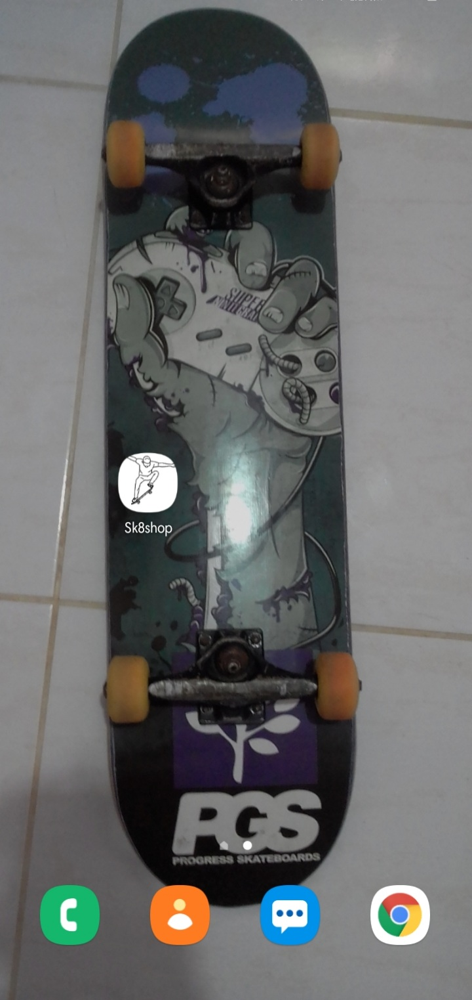
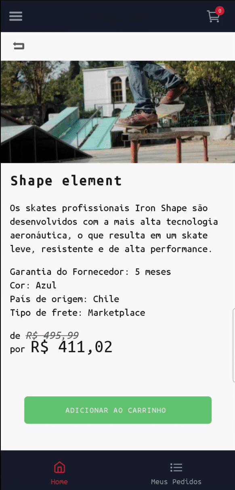

<h1 align="center">
  Sk8shop
</h1>

## Table of contents:

- [About the project](#about-the-project)
- [Technologies](#technologies)
- [Prerequisites](#prerequisites)
- [Getting started](#getting-started)
- [File structure](#file-structure)
- [License](#license)
- [Contact](#contact)

## About the project:

<div>
  
  
  
  
  
  
  
  
</div>

Project developed with React Native, with the purpose of simulating a skateshop.

Objective:
- It's supposed to show all products sorted alphabetically or by price (asc).
- It's supposed to show product details.
- Add and remove products from shopping cart.
- Simulate a purchase, adding products to "my purchases" list.
- Remove products from "my purchases" list.

## Technologies

:white_check_mark: React Native\
:white_check_mark: Styled-components\
:white_check_mark: Firebase (Firestore, Authentication)\
:white_check_mark: Axios\
:white_check_mark: React-navigation\
:white_check_mark: Redux\
:white_check_mark: Redux-persist\
:white_check_mark: Git-commit-msg-linter\
:white_check_mark: React Hooks\
:white_check_mark: Babel-plugin-root-import\
:white_check_mark: Vector Icons\
:white_check_mark: Immer\
:white_check_mark: Lodash\
:white_check_mark: lottie-react-native\
:white_check_mark: react-native-paper\
:white_check_mark: moti\
:white_check_mark: react-native-reanimated\
:white_check_mark: react-native-image-pan-zoom\
:white_check_mark: Date-fns\
:white_check_mark: react-native-fast-image\
:white_check_mark: redux-saga\
:white_check_mark: Typescript\
:white_check_mark: Jest\
:white_check_mark: @testing-library/jest-native\
:white_check_mark: @testing-library/react-hooks\
:white_check_mark: @testing-library/react-native

## Prerequisites

Before proceeding, it is ideal that you have the environment set up to create applications in React Native, for this you can follow the guide of the link below:

[React Native's Environment (Android/iOS)](https://reactnative.dev/docs/environment-setup)

## Getting started

#### First you clone the project:

```bash
$ git clone https://github.com/MRLSK8/SK8shop.git && cd SK8shop
```

#### Then you run the following command to install packages:

```bash
$ yarn install
```

#### Next, you start the project:

```bash
$ yarn start
```

#### Finally you run it like so:

```bash
$ yarn android
```

#### If you want to build it and generate an APK just do the following

```bash
$ yarn android:build
```

#### It will generate an APK on android/app/build/outputs/apk/release/app-release.apk, send it to your cellphone and install it.
#### And that's it! you're ready to use.

## Running Tests
#### You just need to run this command:
```bash
  $ yarn test
```
#### In order to check the tests coverage out, run this command instead:
```bash
  $ yarn test:coverage
```

## File structure

The file structure are in the following way:

```bash
├── src/
│   ├── @types/
│   │   └── index.d.js
│   ├── assets/
│   │   └── Icons
│   │       └── skateboard.svg
│   ├── components/
│   │   ├── GoBackButton/
|   |   |   ├── index.tsx
|   |   |   └── style.ts
|   |   ├── ImagePreview/ 
|   |   |   ├── index.tsx
|   |   |   └── style.ts
|   |   ├── ProductItem/ 
|   |   |   ├── index.tsx
|   |   |    style.ts
│   │   └── ScreenHeader/
|   |       ├── index.tsx
|   |       └── style.ts
│   ├── config/
│   │   └── statusBarConfig.ts
│   ├── helpers/
│   │   └──  numberToCurrency.ts
│   ├── hooks/
│   │   └── reduxHooks.tsx
│   ├── routes/
│   │   └── app.routes.ts
│   │   └── auth.routes.ts
│   │   └── bottom-tabs.routes.ts
│   │   └── index.ts
│   │   └── products.routes.ts
│   │   └── purchases.routes.ts
│   │   └── styles.ts
│   ├── screens/
│   │   ├── AppScreens/
|   |   |   ├── myPurchases/ 
|   |   |   |   ├── index.tsx
|   |   |   |   └── style.ts
|   |   |   ├── productDetails/ 
|   |   |   |   ├── index.tsx
|   |   |   |   └── style.ts
|   |   |   ├── productsList/ 
|   |   |   |   ├── index.tsx
|   |   |   |   └── style.ts
|   |   |   └── shoppingCart/ 
|   |   |       ├── index.tsx
|   |   |       └── style.ts
|   |   └── AuthScreens/ 
|   |       ├── signIn/ 
|   |       |   ├── index.tsx
|   |       |   └── style.ts
|   |       └── signUp/ 
|   |           ├── index.tsx
|   |           └── style.ts
│   ├── services/
│   │   └── api.ts
│   ├── store/
│   │   └── actions/
│   │   └── ducks/
│   │   └── sagas/
│   │   └── types/
│   │   └── index.ts
│   ├── styles/
│   │   ├── globalStyles.ts
│   │   └── index.ts
│   └── index.tsx
├── .buckconfig
├── .editorconfig
├── .eslintrc.js
├── .eslintrc.json
├── .gitattributes
├── .gitignore
├── .prettierrc.js
├── .watchmanconfig
├──  app.json
├── babel.config.js
├── index.js
├── LICENSE
├── metro.config
├── package.json
├── react-native.config.js
├── tsconfig.js
├── yarn.lock
```

## License:

This project is licensed under the MIT License - see the [LICENSE](LICENSE) file for details.


## Contact:

[Facebook](https://www.facebook.com/profile.php?id=100004301021977 'My facebook')  |  [Instagram](https://www.instagram.com/mrlsk8/ 'My instagram')  |  [Linkedin](https://www.linkedin.com/in/mrlsk8/ 'My linkedin')

<div align="center">
  Made with :heart: by <strong>Marcelo Lima</strong> 😊
</div>
